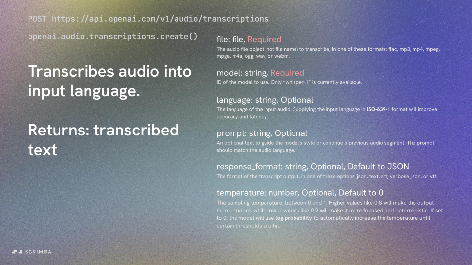
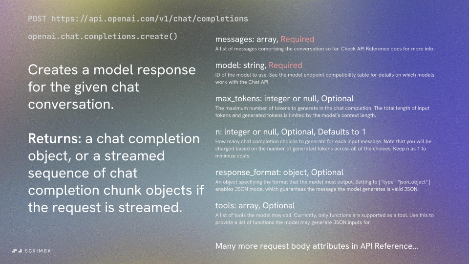
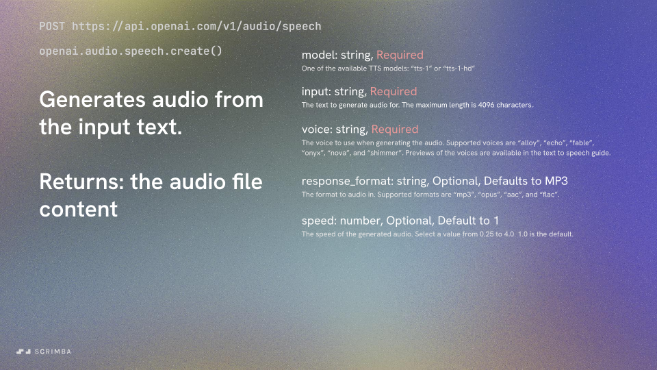

# Making An Assistant That Can Respond With Speech

This article will walk you through how you can turn an audio prompt into text, send that prompt to ChatGPT, get a response, and finally turn that response into audio. To supplement this article I created an interactive screencast (scrim) version of this article [HERE](https://scrimba.com/scrim/cZ2QLwTG). I also suggest looking through the [OpenAI API reference](https://platform.openai.com/docs/api-reference/introduction) to get a better understanding of what tools we will be using.

## Setup Our Dependencies
First we need to install our dependencies:

- fs
- openai

## Start Building Our Project
Now we make our connection to the openai API server, using our API key. If you're watching the scrim above, you can store your API key in the environment variables for the browser environment by following the steps in [this article](https://different-marmoset-f7b.notion.site/How-to-set-environment-variables-in-Scrimba-f8edc638005a4e97b557c6ab1752248a).

```
const openai = new OpenAI({
    apiKey: process.env.OPENAI_API_KEY
});
```

## Transcribe/Translate Audio
Firstly we will demonstrate how to turn spoken audio into text. Whether that speech is in English or not, don't worry. We can translate to or from English using the following steps. Below is a slide showing the API request body attributes with some explanation of each. Also, [Here](https://platform.openai.com/docs/api-reference/audio/createTranscription) is a link to the part of the API reference describing the request body attributes the `openai.audio.transcriptions.create` endpoint accepts.



Using our OpenAI API connection, we can send our audio to the Whisper model to transcribe and/or translate the audio into text. We will send a request to the `transcriptions` endpoint, `openai.audio.transcriptions.create`, but first we have to create a read stream for the audio using `fs.createReadStream` so that we can send that audio file to the API.

```
const audioData = await fs.createReadStream(audioFilePath);
const transcription = await openai.audio.transcriptions.create({
    model: "whisper-1", 
    file: audioData,
    language: "en" // ISO-639-1 format
});
```
It will respond with a simple object that looks like this if we set the language to "en":
```
// transcription
{ text: 'Where is the Getty Museum located?' }
```

We can also translate the same audio into, lets say, French, by changing the `language` attribute in the request body to `"fr"` (or any other language for that matter):
```
const transcription = await openai.audio.transcriptions.create({
    model: "whisper-1", 
    file: audioData,
    language: "fr" // ISO-639-1 format
});
```

```
// transcription
{ text: 'Où se trouve le musée du Getty?' }
```

## Sending The Transcription To GPT
I very much suggest looking at the [API Reference Docs](https://platform.openai.com/docs/api-reference/chat/create) to see all of your request body options for the `openai.chat.completions.create` endpoint. There are many, but here are a few examples:



A Note on `role` within our request body `messages` attribute:

```
messages: [
        {"role": "system", "content": "You are a helpful assistant."},
        {"role": "user", "content": question}
    ]
``` 

Roles are a way to guide the model’s responses. Commonly used roles include “system,” “user,” and “assistant.” The “system” provides high-level instructions, the “user” presents queries or prompts, and the “assistant” is the model’s response. Using roles strategically can significantly improve the model's output.

**System Role:** Set clear context for the system. Begin with a system message to define the context or behavior you desire from the model. This acts as a guidepost for subsequent interactions.

**User Role:** Make explicit/direct user prompts. Being clear and concise in the user role ensures the model grasps the exact requirement, leading to more accurate responses.

If the model’s response isn’t satisfactory, use the user role to provide feedback or refine the query, nudging the model towards the desired output. Think of the interaction as a back-and-forth dialogue. By maintaining a sequence of user and assistant messages, the model can reference prior messages, ensuring context is retained. Ultimately, understanding and effectively utilizing roles in messages is akin to having a clear conversation with another human. By setting context and guiding the discourse, we can significantly bolster the performance and relevance of the model’s outputs.

> NOTE: Be aware that some models do not generally pay as much attention to the system message equally. For example, gpt-3.5-turbo-0301 does not generally pay as much attention to the system message as gpt-4-0314 or gpt-3.5-turbo-0613

Now that we have transcribed our audio, we can send it to the `chat.completions.create` endpoint to get ChatGPT to respond to the question we posed. 

```
// transcription = { text: 'Where is the Getty Museum located?' }
const question = transcription.text 
const completion = await openai.chat.completions.create({
    messages: [
        {"role": "system", "content": "You are a helpful assistant."},
        {"role": "user", "content": question}
    ],
    model: "gpt-4-1106-preview",
    max_tokens: 60,
});
```

Notice for our example we have set the `max_tokens` to `60`. This will determine the amount of response tokens we will receive. You will see a little later how that affects our response.

## Handling The GPT Response
The completion object we receive from GPT will look something like this:

```
{
    id: "chatcmpl-8VudWT5n7Wonmmnc4cCBdrGDjrvmM", 
    object: "chat.completion", 
    created: 1702616570, 
    model: "gpt-4-1106-preview", 
    choices: [
        {
            index: 0, 
            message: {
                role: "assistant",
                content: "The Getty Museum is located in Los Angeles, California. It actually consists of two campuses: 1. The Getty Center: Located in the Brentwood neighborhood of Los Angeles, the Getty Center is well-known for its architecture, gardens, and views overlooking Los Angeles. The museum at this campus houses an extensive"
                }, 
            finish_reason: "length"
        }
    ], 
    usage: {
        prompt_tokens: 24, 
        completion_tokens: 60, 
        total_tokens: 84
    }, 
    system_fingerprint: "fp_3905aa4f79"
}
```

Notice that the response has an attribute `finish_reason` that has a value of `"length"`. This means that our response was cut short because it surpassed the maximum amount of tokens. That's okay in this case, because we set the `max_tokens` property to be `60`. This is why our `completion.choices[0].message.content` seems to stop abruptly in the middle of a sentence. We wanted a shorter response for this demonstration, but usually you want the `finish_reason` value to be `"stop"`. Meaning that the model stopped because it was finished.

## Create Speech From Response

Lastly, we will turn the GPT response into speech. Here is the [API Reference Docs](https://platform.openai.com/docs/api-reference/audio/createSpeech) portion pertaining to the `openai.audio.speech.create` endpoint, also referenced below:



If we study the completion object above that we got back from ChatGPT, we can see that the part we need in this case is `completion.choices[0].message.content`. This portion of the completion object contains the assitant's response to our question.

```
const mp3 = await openai.audio.speech.create({
    model: "tts-1",
    voice: "alloy",
    input: completion.choices[0].message.content,
});
```

Here we use the `openai.audio.speech.create` endpoint to send the text response we got back from GPT to the TTS model in order to receive an audio file back. Once we receive the audio file from the TTS model, we need to create a buffer for the file then write it locally to our machine.

```
const buffer = Buffer.from(await mp3.arrayBuffer());
await fs.promises.writeFile("./speech.mp3", buffer);
```

If everything worked properly, we should have our speech saved in an audio file called `speech.mp3`, where we can then handle it accordingly.

## Conclusion

Hopefully this gave you some ideas of how to use the OpenAI API. We could have made a loop that continuously asks a user for audio prompts, then responds in audio as well. We could also use this to create a translation application. Give it a try on your local computer and build it out into your next cool application. Good luck, and have fun!